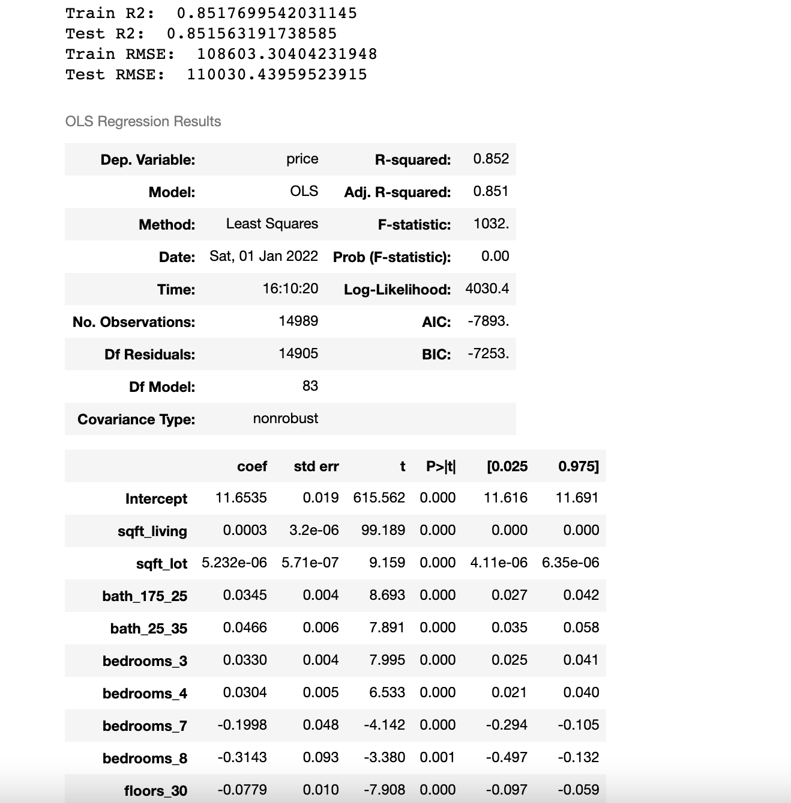
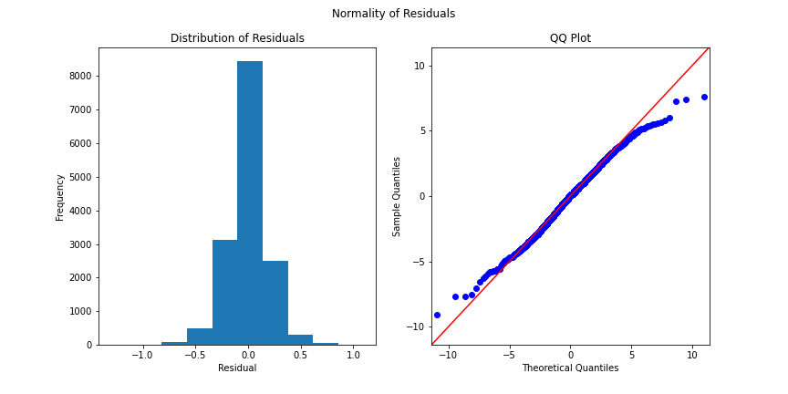
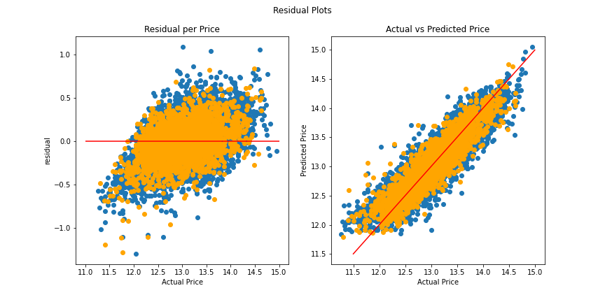

# King County Housing Price Prediction Model

**Authors**: Melody Bass

## Overview

The focus of this project is to build a multiple linear regression model to predict sale price for houses in King County, Washington. The model was built from a dataset of the county's home sale prices and features using an iterative approach and can be found [here](./data/kc_house_data.csv). The dataset contains information on over 21,000 houses sold during the years 2014 - 2015. Following is a description of the features that we will include in our model:

* price - Sale price (prediction target)
* bedrooms - Number of bedrooms
* bathrooms - Number of bathrooms
* sqft_living - Square footage of living space in the home
* sqft_lot - Square footage of the lot
* floors - Number of floors (levels) in house
* waterfront - Whether the house is on a waterfront
* view - Quality of view from house
* condition - How good the overall condition of the house is. Related to maintenance of house.
* grade - Overall grade of the house. Related to the construction and design of the house.
* sqft_above - Square footage of house apart from basement
* sqft_basement - Square footage of the basement
* zipcode - ZIP Code used by the United States Postal Service

The first sections focus on investigating, cleaning, wrangling, and engineering some new features. The next section contains 5 models and evaluation of each, ultimately leading to us to select our best model for predicting house prices. Finally, I will make recommendations and provide insight on house features that have the biggest impact on sale price to a team of real estate agents that are looking to get into the business of remodeling houses.

## Business Problem

A group of real estate agents based out of Seattle are looking to expand their business into remodeling houses in addition to selling. They want to accurately predict the value of homes based on the features of the house so they can maximize profits for their remodels. In order to accomplish this, they have enlisted my help in building a model to predict the price of homes in the county. They have a substantial amount of money to start investing in homes to remodel, so they are interested in obtaining information about low end and high end houses.

## Data

The dataset used for this analysis can be found [here](./data/kc_house_data.csv). It contains a wealth of information about home sales in King County, WA from 2014 - 2015. The final model included homes ranging in price from 78,000 to 3.1 million dollars.

## Methods

1. Feature Engineering:

    * Renovated - Records whether a home was renovated within the last 30 years. Any renovations older than 30       years are likely out of date.
    * Basement - Records whether a home has a basement or not.
    * Bin bathrooms - Converts number of bathrooms into intervals to cut down on variables.
    * Create dummy variables for catergorical features.
    
2. Explore Modified Feature Distributions and Linearity Checks Against Price:

    * Are the features normally distributed?
    * Do features have a linear relationship with price?
    * Do we have multicollinearity in our model?
    
3. Linear Regression Modeling

    * Apply transformations to features to obtain strongest linear relationship to price.
    * Remove outliers from features and dependent variable.
    * Removing any insignificant features from the model.
    * Find the highest R-Squared and lowest RMSE values, monitor differences between train and test sets.
    * Validate the model by running normality and homoscedasticity assumptions for linear regression models.
    * Scale final model to determine which features have the most impace on price.

## Results

Following is a description of the different model iterations that were performed:

   * Baseline Model - Using all features
   * Model A - Remove outliers from price (dependent variable)
   * Model B - Remove outliers from continuous predictors
   * Model C - Remove insignificant features
   * Model D - Log transform price (dependent variable)
    
Model D was selected as our final model even though it did not have the highest R2 value or lowest RMSE. 
 <br />
It was the best performing model when considering linear regression assumptions of normality and homoscedasticity.    <br />
 <br />
 <br />
  

## Conclusions

Multiple linear regression analysis was used to build a model to predict housing prices in King County, WA. After 4 iterations from out baseline model, the results of the final regression model (Model D) indicated that 83 predictors explained 85.2% of the variance in the dataset(R2= 0.852). The RMSE of the final model was $108,603.30, which is the error in our price prediction. The range of prices in the final model was 78k to 3.1 million dollars.  All of the independent variables used in the model were significant predictors of sale price with p-values less than 0.05.

Following are features that have the most positive effect on sale price:

   * For every 1 square foot of living space, the price is increased by 0.03%.
   * Location is 2nd highest indicator of price. Our top 10 zipcodes (98039, 98004, 98112, 98109, 98119,            98102, 98105, 98040, 98199, 98107) were 142 to 281% higher in price than our baseline zipcode of 98001.

Following are features that have the most negative impact on sale price:

   * Homes with a basement decreases the price by 6.11%.
   * Homes with 3 floors decreases the price by 7.49%. More floors is less desirable.

Following are some other notable conclusions:

   * Price for homes with a waterfront are 64.5% higher than homes without a waterfront.
   * Homes that have been renovated in the last 30 years will increase the price by 8.40%.
   * Homes with a view rated as 4 (highest rating- i.e. Mt. Rainier, Olympics, Cascades, Territorial, Seattle      Skyline, Puget Sound, etc) increase the price by 45.59%.

Future work to improve on this model would be to make multiple models in different price ranges (i.e. 100k - 500k, 500k - 1 million, etc). Our model has limitations due to the wide range of prices in the dataset such as an error of $108,000 in predicting the price, especially on the low end (error is higher than the lowest priced home in the model). Another interesting extension to the project for future work is adding school districts grade into the model.


## For More Information

Please review my full analysis in [my Jupyter Notebook](./student.ipynb) or my [presentation](./presentation.pdf).

For any additional questions, please contact **Melody Bass @ meljoy1099@gmail.com**

## Repository Structure

```
├── README.md                           <- The top-level README for reviewers of this project
├── student.ipynb                       <- Narrative documentation of analysis in Jupyter notebook
├── presentation.pdf                    <- PDF version of project presentation
├── data                                <- Both sourced externally and generated from code
└── images                              <- Both sourced externally and generated from code
└── code.                               <- Both sourced externally and generated from code
```

